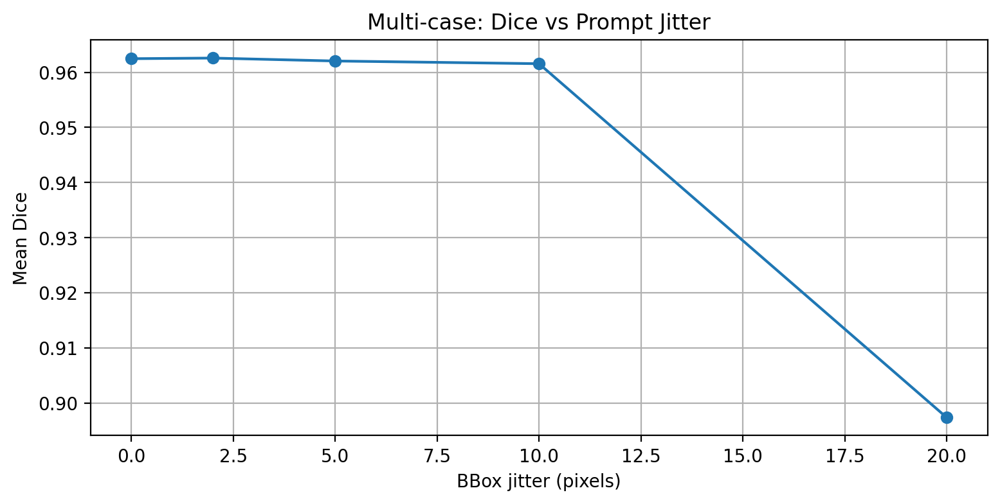
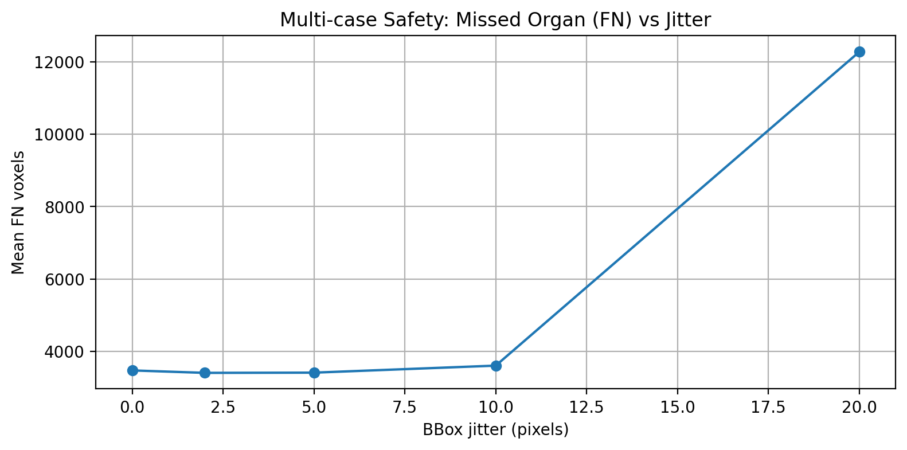
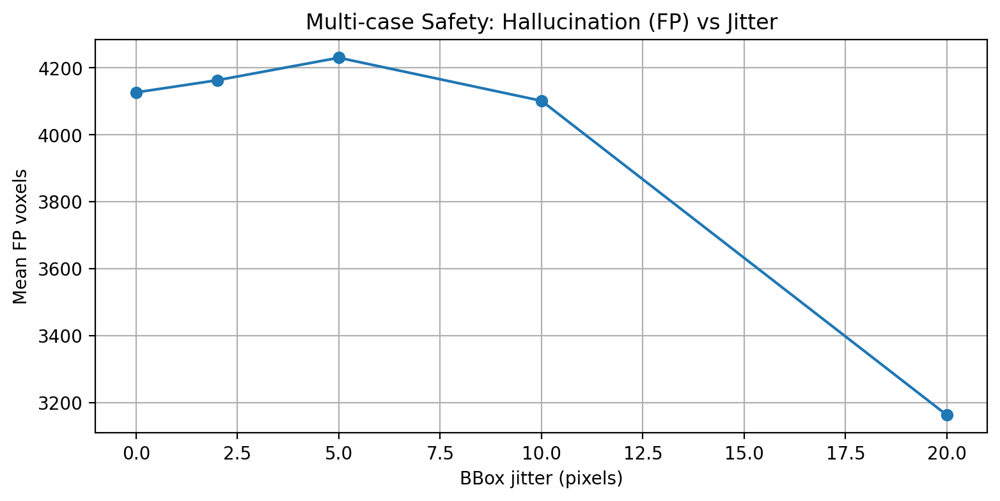
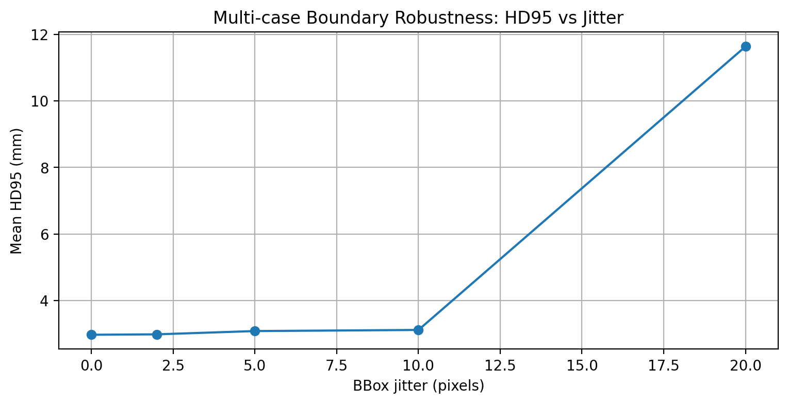
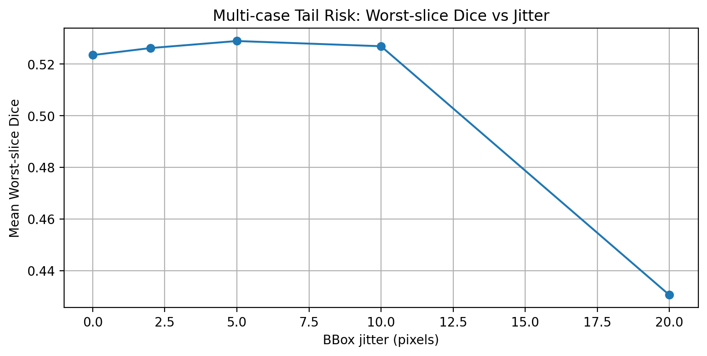

# MedSAM2 Segmentation Safety Analysis

> **Research Project:** Robustness Analysis of Prompt-Based Medical Segmentation (MedSAM2)


---

## Abstract

Prompt-based medical segmentation models such as MedSAM2 rely on user-provided inputs (e.g., bounding boxes or points) to guide segmentation. However, the robustness of these models to small variations in prompts remains an important concern for real-world clinical deployment.

In this project, we conduct a systematic robustness analysis of MedSAM2 using the Medical Segmentation Decathlon (MSD) Spleen CT dataset. We introduce **prompt jitter experiments**, where bounding box prompts are randomly perturbed to simulate annotation variability.

We evaluate performance using multiple metrics:

- Dice score  
- False Positive voxels  
- False Negative voxels  
- Hausdorff Distance (HD95)  
- Worst-slice Dice (tail-risk metric)  

Additionally, we analyze **uncertainty estimation** using prompt perturbation ensembles.

Results show that MedSAM2 is robust to small prompt variations but exhibits significant degradation under large perturbations, especially near object boundaries.

---

## Project Overview

MedSAM2 is a prompt-based segmentation model derived from the Segment Anything Model (SAM2), designed for 3D medical imaging.

This project investigates:

- robustness of segmentation under prompt perturbations  
- failure modes in 3D medical segmentation  
- tail-risk behavior using worst-slice Dice  
- uncertainty estimation from prompt ensembles  

Experiments are conducted on the **MSD Spleen CT dataset**.

---

## Experiment Pipeline

```
CT Volume
   ↓
CT Windowing
   ↓
Key Slice Selection
   ↓
Bounding Box Prompt
   ↓
MedSAM2 Inference
   ↓
Prompt Jitter Experiments
   ↓
Segmentation Output
   ↓
Evaluation Metrics
```

---

## Methodology

### Dataset

We use the **Medical Segmentation Decathlon (MSD) Spleen dataset**:

https://medicaldecathlon.com/

Each case contains:

- 3D CT volume  
- binary spleen mask  

---

### Baseline Segmentation

Steps:

1. Load CT and GT
2. Apply CT windowing
3. Select key slice (max spleen area)
4. Generate bounding box prompt
5. Run MedSAM2
6. Propagate segmentation across volume

---

### Prompt Jitter Experiment

Bounding box is randomly perturbed:

```
0 px
2 px
5 px
10 px
20 px
```

Each level is tested with multiple trials.

This simulates **real-world annotation variability**.

---

## Evaluation Metrics

| Metric | Description |
|------|------------|
| Dice | Overlap between prediction and ground truth |
| FP | False positive voxels (hallucinations) |
| FN | False negative voxels (missed organ) |
| HD95 | Boundary error (95th percentile) |
| Worst Slice Dice | Minimum Dice across slices (tail risk) |

---

## Uncertainty Estimation

We compute uncertainty from multiple prompt perturbations:

```
p(x) = mean prediction
U(x) = p(x)(1 - p(x))
```

Interpretation:

- Low → stable prediction  
- High → unstable / uncertain region  

This highlights:

- boundary ambiguity  
- failure-prone regions  

---

## Results

### Multi-Case Summary

| Jitter | Dice | FN | FP | HD95 | Worst Slice |
|-------|------|----|----|------|------------|
| 0 px  | 0.962 | 3470 | 4127 | 2.97 | 0.524 |
| 2 px  | 0.963 | 3403 | 4163 | 2.99 | 0.526 |
| 5 px  | 0.962 | 3409 | 4231 | 3.08 | 0.529 |
| 10 px | 0.962 | 3603 | 4102 | 3.12 | 0.527 |
| 20 px | 0.897 | 12275 | 3163 | 11.64 | 0.431 |

---

## Experimental Plots

### Dice vs Jitter


### False Negatives vs Jitter


### False Positives vs Jitter


### HD95 vs Jitter


### Worst Slice Dice vs Jitter


---

## Visualization Tool

Interactive slice viewer:

```
python view_case.py \
--ct path_to_ct.nii.gz \
--gt path_to_gt.nii.gz \
--pred path_to_pred.nii.gz
```

Controls:

```
j/k → scroll slices
g → toggle GT
p → toggle prediction
```

Displays:

- CT slice  
- segmentation  
- FP / FN errors  

---

## Installation

```
conda create -n medsam2 python=3.10
conda activate medsam2
pip install torch torchvision
pip install numpy SimpleITK matplotlib scikit-image
```

---

## Running Experiments

Baseline:

```
python msd_spleen_medsam2_infer.py
```

Jitter experiments:

```
python msd_prompt_jitter_multicase.py
```

Uncertainty:

```
python msd_multi_uncertainty_jitter.py
```

---

## Project Structure

```
medsam2-segmentation-safety-analysis

├── msd_prompt_jitter_multicase.py
├── msd_multi_uncertainty_jitter.py
├── view_case.py
├── plot_slice_dice.py
├── results/
├── README.md
```

---

## Discussion

Key findings:

- robust under small jitter  
- performance drops at large perturbations  
- boundary errors increase significantly  
- worst-slice Dice reveals hidden failures  

---

## Future Work

- uncertainty-aware models  
- calibration analysis  
- multi-organ evaluation  
- deployment UI  

---

## Acknowledgements

Based on MedSAM2:

https://github.com/bowang-lab/MedSAM2

---

## Author

Harish Kurla Shankarareddy  

GitHub:  
https://github.com/Harish-Kurla-Shankarareddy

---

## License

Apache 2.0
